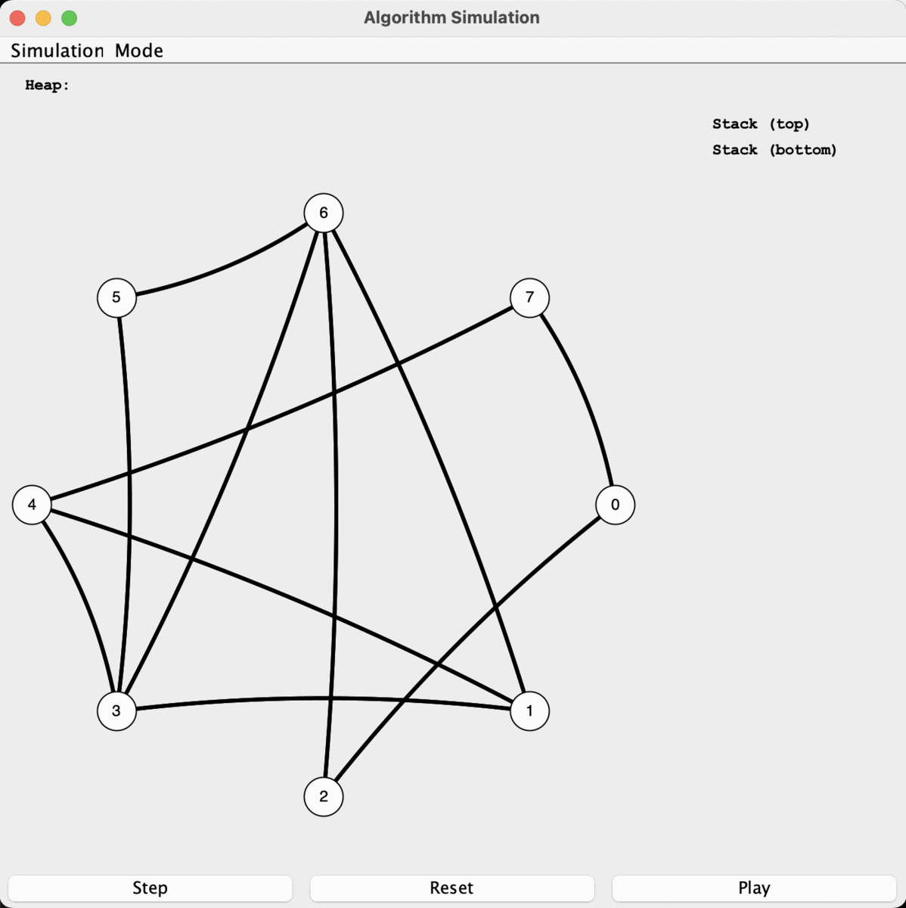

# Graph Algorithm Simulator

This is one of my recent projects that uses a graph data structure that uses a priority queue (heap) and stack with many algorithms to help update the graph.

  - The graph is undirected
  - Nodes and Edges have unique ID's
  - Neighbors cannot have the same color
  - Lowest has Max priority
  - The graph can be edited and transformed by hand

